# CSharp.Rop.Generic.Result

This this library started as a copy of the excellent library of Vladimir Khorikov [CSharpFunctionalExtensions](https://github.com/vkhorikov/CSharpFunctionalExtensions). 

The idea of "Railway Oriented Programming" by Scott Vlashin 
https://fsharpforfunandprofit.com/rop/ has proven to be very useful in our project.

Some chnages:

1. merge `Result<T>`, `Maybe<T>` to one type `Result<T>` (logical equal to `Result<Maybe<T>>`)
2. no generic type `Result<T,E>` with 2 type parameters. 
3. type of error object in Result<T> was changed to `struct Error`.
4. no async support at the moment 
5. focused on operators for merged type.

Therefore we have tried to merge the types `Result<T>` and `Maybe<T>` to create a three-track railway type.

In C# every function has 3 possible results, a valid object/value, null or an exception.
The return of null is still often used in our existing code, e.g. to signal: not found, no result. 

The generic `Result<T>` Type presented here is intended to do just that explicitly and provide the necessary operators for further processing that is as `"if-else"` free as possible.

##### Result States:  
-   **V**alue  
-   **N**one  
-   **E**rror  
the three-tracks of our railway

```CSharp
public partial struct Result<T> 
{
    private readonly Error _error;
    private readonly T _value;

    public bool IsFailure { get; }
    public bool IsSuccess => !IsFailure
    public bool HasValue { get; }
    public bool IsNone => IsSuccess && !HasValue
````

Migration of existing functions:

before | after
------------ | -------------
`MyInfo MyFunc(MyParam a)` | `Result<MyInfo> MyFunc(MyParam a)`
`return null;` | `return Result.None;`
`throw new Exception("error message");` | `retrun new Error("error message");`
`return new MyInfo( 1, "");` | `return new MyInfo( 1, "");`

### Operators:
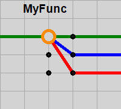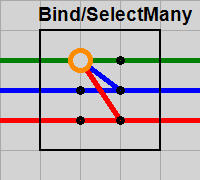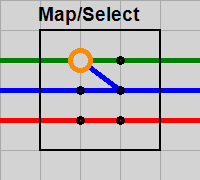  
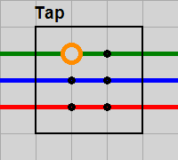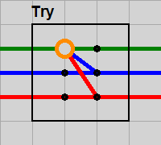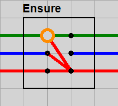  
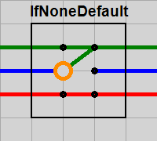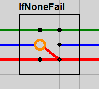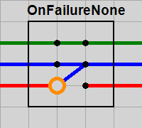  
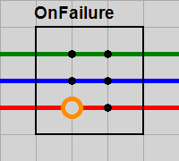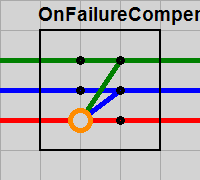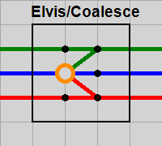  
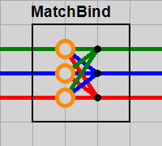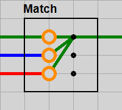  

####


